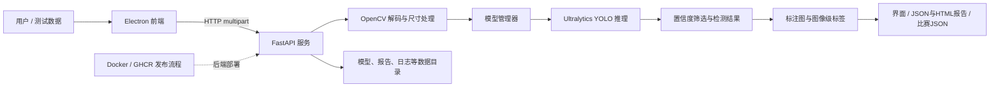

# SF-2026-01 竞赛答辩 PPT 逐页提纲

> 适用赛题：中国移动杯·第二届浙江省大学生人工智能竞赛，算法挑战赛赛题一“监控场景的火情识别算法设计和实现”。
>
> 本提纲依据当前仓库实现和用户提供的赛题说明整理。`【已实现】`为当前软件已有能力；`【竞赛适配】`为参赛提交所需或建议补充的工作；`【待实测】`必须用本队实际实验结果填写。不要把占位项当作实验结论。

## 答辩主线

面向监控场景火情早期识别，构建从图像输入、YOLO 目标检测、图像级火情判定，到结果可视化、报告留存和容器化运行的完整系统；针对赛题提交要求，把目标框转换为每张图像的二值标签，并用图像级 Precision、Recall 完成验证。

## 逐页内容

### 1. 封面：监控场景火情智能识别系统

- 副标题：SF-2026-01 算法挑战赛技术方案
- 展示内容：系统名称、赛题编号、答辩日期。
- 版式建议：用“原始监控图像 / 检测框结果”作为主视觉，保持简洁。
- 匿名要求：竞赛材料需遵守匿名规则。除非决赛通知明确要求，不放学校、队伍、队员、指导教师、实验室标识或可识别信息。
- 讲述提示：一句话交代目标：“把监控图像转化为可解释、可复核的火情判断结果。”

### 2. 场景与任务：从监控画面中尽早发现火情

- 监控场景存在光照变化、背景干扰、目标尺度变化、明火与阴燃形态差异等难点。
- 赛题要求：识别图像中是否存在火焰；提交格式为以图像名为键、`0/1` 为值的 JSON。
- 评价指标：图像级 Precision、Recall。
- 讲述提示：赛题最终判定的是“这张图有无火”，不是只看检测框画得是否漂亮。

### 3. 系统总体方案：检测模型与应用工程协同

- 【已实现】Electron 桌面端、FastAPI 推理服务、Ultralytics YOLO 接口、OpenCV 图像处理。
- 【已实现】单图与批量检测、视频/摄像头逐帧检测、告警汇总、报告、历史记录、模型管理。
- 【竞赛适配】面向测试目录批量推理，生成严格符合赛题 schema 的图像级 JSON。
- 讲述提示：强调系统不是单一模型演示，而是覆盖输入、推理、输出、管理与部署的应用链路。

### 4. 软件架构与数据流



- Electron 主进程负责启动后端、轮询 `/health`、管理窗口和应用数据目录。
- Preload 通过受控 IPC 暴露窗口控制、后端状态及视频转换能力。
- 前端通过 HTTP 调用 FastAPI；推理计算在 Python 后端完成。
- 【竞赛适配】比赛专用 JSON 导出应与现有可视化报告分开，保证提交内容只有文件名和 `0/1` 标签。

### 5. 核心算法链路：目标框到图像级结论

1. 读取图像并通过 OpenCV 解码；最长边超过 4096 像素时按比例缩小。
2. 将图像交给当前加载的 Ultralytics YOLO 模型，按置信度阈值执行推理。
3. 读取检测框坐标、置信度、类别和推理耗时。
4. 对每个检测框应用阈值；存在至少一个有效火焰框则图像标签为 `1`，否则为 `0`。
5. 返回检测框用于标注展示，并汇总火情图数、安全图数和报告信息。

```text
image_label = 1  if any(fire_box.confidence >= threshold)
image_label = 0  otherwise
```

- 【已实现】`/predict`、`/batch_predict` 返回检测框、`fire_count`、模型名及耗时；单图/批量检测会保存 JSON 和 HTML 报告。
- 【竞赛适配】需要新增或使用独立导出脚本，把每张测试图的 `fire_count > 0` 映射为整数标签，并校验文件名完整性和 JSON 格式。
- 【需核实】当前后端的 `fire_count` 按置信度统计检测框，没有显式按类别 ID 过滤火焰类；单类别火焰模型可直接映射，多类别模型必须先筛选火焰类别。
- 讲述提示：阈值应使用验证集选取，不能为了追求单一指标在测试集上反复调参。

### 6. 关键工程流程：模型、输入和运行保护

- 【已实现】启动时检查模型与应用数据目录；模型可扫描、上传、加载、切换和删除。
- 【已实现】图片上传上限 50 MB；模型上传上限 500 MB；批量检测最多 20 张。
- 【已实现】按 CUDA 可用性选择设备，否则回退 CPU；推理放入线程池执行。
- 【已实现】报告同时存为 JSON、HTML；Electron 桌面历史索引保存在浏览器 `localStorage`。
- 【需核实】Dockerfile 中安装的是通用 PyTorch 依赖，仓库未证明容器使用 CUDA；答辩时不要直接宣称云端 GPU 推理。

### 7. 视频扩展与告警交互

- 【已实现】选择本地视频或访问摄像头；前端按设定间隔将 Canvas 当前帧编码为 JPEG 并调用 `/predict`。
- 【已实现】检测框叠加、趋势曲线、暂停/继续、截图/录制等交互；视频告警按 5 秒窗口进行节流汇总。
- 讲述提示：这是系统工程扩展，比赛主要评估静态图像级标签；视频功能不能代替赛题集上的指标验证。

### 8. 实验设计与评测指标

- 数据：赛题方提供 1100 张训练图像，包含 COCO 目标检测标注 `train_coco.json` 和图像级标注 `train_image.json`。
- 划分：【待实测】写明训练/验证划分策略、随机种子和各集合数量；测试集严格按比赛规则使用。
- 指标：以“图像是否有火”为单位统计 TP、FP、FN。
- `Precision = TP / (TP + FP)`；`Recall = TP / (TP + FN)`。
- 对比项：【待实测】基线模型、改进方案、置信度阈值和推理耗时；只展示本队可复现结果。
- 结果表：【待实测】填入验证集 Precision、Recall、阈值、硬件、平均/分位推理耗时及样本数。
- 讲述提示：目前仓库没有训练脚本、数据划分配置或正式评测记录；仓库样例报告中的 `fake-model` 是测试用模拟结果，不可作为模型成绩。

### 9. 部署与可用性

- 【已实现】Dockerfile 提供 FastAPI 后端容器启动方式，监听 `0.0.0.0:8000`。
- 【已实现】GitHub Actions 工作流可在版本标签触发时构建并推送后端镜像到 GHCR。
- 【已实现】Electron 启动时拉起本地服务；后端通过 `/health` 进行健康检查。
- 【待验证】真正的云主机/云算力部署、模型挂载、网络访问、并发、资源消耗、冷启动和连续运行情况。
- 【竞赛适配】按通知由队长在焕新社区申请算力，资源池选择“广东-1”；获批后完成端到端测试，准备可复现的部署命令和日志截图。
- 初赛通过焕新社区提交预测结果文件；另按通知向组委会邮箱提交模型网盘链接。结果由队长代表团队上传。

### 10. 现阶段证据与局限

- 【已有证据】后端路由测试覆盖健康检查、批量预测、标注图、报告生成/读取/删除、模型删除等路径；告警策略有独立 Node 测试。
- 【局限】当前应用接口返回检测框和报告对象，不直接产出比赛要求的图像名到二值标签 JSON。
- 【需核实】图像级标签映射前需确认模型类别定义；现有 `fire_count` 只做置信度筛选，不按类别名称或类别 ID 区分。
- 【局限】当前仓库可见 `data/models/best.pt`，但不能从仓库确认训练数据来源、模型具体配置、超参数、验证集表现或泛化能力。
- 【局限】现有视频流程是本机前端帧循环，不等同于云端视频流服务。
- 【讲述提示】把限制转化为下一阶段计划，避免暗示这些项目已经完成。

### 11. 下一步计划与风险控制

1. 明确模型版本、权重来源、训练配置和验证集划分。
2. 实现测试集批量推理及比赛 JSON 导出；校验键集合、标签类型、图片数量和无重复文件名。
3. 在验证集选阈值，并用图像级标签计算 Precision、Recall。
4. 在赛事指定算力环境完成容器部署、模型加载和批量推理验收。
5. 记录版本、依赖、硬件、耗时及随机种子，形成可复现实验档案。
6. 按赛事要求保护训练数据，只用于本赛题，匿名提交。

### 12. 总结与答疑

- 总结句：以目标检测提供可视化证据，以图像级判定满足赛事评价，以工程化部署和结果留档支撑应用验证。
- 收尾页只放结论与答疑，不新增未经验证的准确率、速度或部署结论。

## 上台前必须补齐

- 【待实测】最终模型架构/版本、权重训练来源、训练超参数、训练与验证集划分。
- 【待实测】验证集图像级 Precision、Recall、置信度阈值、推理速度、硬件与显存/内存占用。
- 【待验证】赛题格式 JSON 导出及自动校验；在指定云算力上的完整部署与推理。
- 用真实样例替换示意图，并检查画面中没有训练集泄露、学校/队伍/成员身份或非授权数据。

## 赛事执行与合规提示

- 通知所列报名截止日期为 2026 年 9 月 18 日，当前日期为 2026 年 10 月 2 日；初赛计划于 10 月中旬开展，实际提交格式细则和截止时间以焕新社区及组委会后续通知为准。
- 决赛计划于 2026 年 11 月在湖州师范大学举行；通知称初赛排名前 30% 获得决赛资格，具体安排以决赛通知为准。
- 算力由队长账号代表团队申请；按指引填写赛题名称、学校名称加队伍名称并选择“广东-1”资源池。比赛资源仅用于赛题开发，比赛结束后按要求回收。
- 严格保护赛题数据，只用于本竞赛；按组委会要求在赛后删除或归还数据。
- 作品资料遵守匿名规则，不出现学校、团队或队员身份信息；模型链接、预测文件和答辩附件提交前做匿名检查。