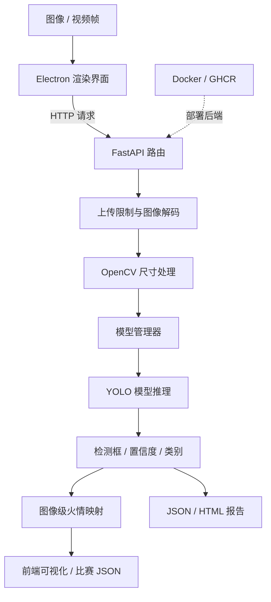

# 监控场景火情识别系统技术报告（初稿）

> 对应赛题：SF-2026-01，监控场景的火情识别算法设计和实现。
>
> 本文是基于当前 FlameDetect Pro 仓库和用户提供的赛事说明整理的报告初稿。`【待补】`字段必须用团队真实信息和实验结果替换。不得将当前仓库的模拟测试输出描述为正式模型成绩。竞赛作品需匿名，提交前删除身份信息并遵守数据保密要求。

## 摘要

针对监控场景中火焰目标尺度变化、背景复杂、光照变化和早期火情难以及时发现等问题，本文介绍一套基于 Ultralytics YOLO 推理接口的火情视觉分析软件。系统由 Electron 桌面端、FastAPI 服务端、OpenCV 图像处理组件和模型管理模块构成，支持单张与批量图片检测、视频/摄像头逐帧检测、检测结果可视化、告警汇总、历史记录及 JSON/HTML 报告。

面向 SF-2026-01，系统将目标检测输出进一步映射为图像级二分类结果：当图像中至少存在一个置信度不低于阈值的火焰检测框时标记为 1，否则标记为 0。赛题要求的测试结果格式为以图像名为键、整数 0/1 为值的 JSON，评价指标为图像级 Precision 和 Recall。当前软件已有检测与报告链路；比赛专用 JSON 导出、正式模型评测以及赛事云算力上的部署验收仍需完成。

**关键词：**火焰检测；YOLO；图像级分类；FastAPI；Electron；云端部署

## 1. 项目背景与任务定义

视频监控已用于城市消防、工业厂区、林区和地下空间等风险场景。监控图像中的火焰可能面积较小、受环境光干扰，且背景纹理复杂。人工巡查和传统视觉规则难以同时满足及时性与稳定性，因此需要通过视觉模型识别火焰目标，并将目标级结果转化为便于业务系统消费的图像级结论。

本项目对应中国移动通信集团浙江有限公司发布的 SF-2026-01 赛题。赛事提供 1100 张训练图像，并提供 COCO 格式目标检测标注 `train_coco.json` 和图像级标注 `train_image.json`。测试集输出要求为 JSON：图像名作为键，`0` 表示无火，`1` 表示有火。赛事以图像级 Precision、Recall 评估结果。

**任务定义：**对输入图像执行火焰目标检测，并产生图像级标签 $y \in \{0,1\}$。设 $B$ 为模型返回的火焰候选框集合，$c_i$ 为第 $i$ 个框置信度，阈值为 $\tau$，则：

$$
y = \begin{cases}
1, & \exists i \in B,\ c_i \geq \tau \\
0, & \text{otherwise}
\end{cases}
$$

## 2. 系统总体设计

### 2.1 技术架构

- **桌面交互层：**Electron 主进程管理窗口、后端进程和用户数据目录；`preload.js` 通过 contextBridge 暴露受控 IPC 能力；`index.html` 实现检测、视频监控、模型管理、历史记录与报告界面。
- **服务/API 层：**FastAPI 提供健康检查、单图预测、批量预测、模型管理、统计、报告读写等 HTTP 路由。
- **视觉推理层：**Ultralytics YOLO 接口加载模型，OpenCV 解码和调整图像尺寸，PyTorch 根据 CUDA 可用情况选择 GPU 或 CPU。
- **数据持久层：**应用数据目录包含模型、上传文件、报告、日志和历史相关数据；桌面端历史索引使用浏览器 `localStorage`。
- **部署层：**Dockerfile 定义后端容器；GitHub Actions 可在版本标签触发时构建并发布容器镜像至 GHCR。当前仓库未提供赛事环境的实际部署验收记录。

### 2.2 架构数据流



## 3. 端到端运行流程

### 3.1 应用启动

1. Electron 应用启动后创建用户数据目录，并准备模型、上传、报告、日志和历史等子目录。
2. 主进程查找可运行的 `backend.exe` 或 Python 后端入口，将数据目录和服务端口通过环境变量传给后端。
3. 主进程启动 FastAPI，并轮询 `/health` 判断服务是否就绪；后端异常退出时会执行有限次数的重试。
4. Python 服务启动时扫描模型目录，查找默认模型。模型文件大于 1 MB 才会作为可用模型扫描；若 CUDA 可用则选择 CUDA，否则使用 CPU。
5. 前端读取服务健康状态、模型状态和报告列表，显示当前模型及服务状态。

### 3.2 单张图片检测

1. 用户选择或拖入图片，并设置置信度阈值。
2. 前端将图片与阈值封装为 multipart 请求，调用 `POST /predict`。
3. 后端限制图片上传大小为 50 MB，使用 OpenCV 解码；最长边超过 4096 像素时等比例缩小。
4. 模型管理器调用当前 YOLO 模型进行推理，推理函数放入线程池运行，返回检测框、类别、置信度、模型名和耗时。
5. 后端筛选满足阈值的检测框并计算 `fire_count`，可选生成标注图；单图检测同时生成 JSON 和 HTML 报告。
6. 前端展示标注结果和统计信息，并把检测记录写入本地历史索引。

### 3.3 批量图片检测

1. 前端对文件去重，最多提交 20 张图片；后端再次过滤无效条目并限制数量。
2. 后端逐张读取、解码和推理。单张异常会记入该条结果，不中断整个批次。
3. 汇总总图数、火情图数、安全图数、检测框数和平均推理耗时。
4. 生成 JSON/HTML 报告并返回各图结果；前端显示批次摘要、结果缩略图、逐图状态和检测耗时。
5. 前端将可用检测图片和结果追加至历史记录，更新告警及报告列表。

### 3.4 视频与摄像头监控

1. 用户选择本地视频，或通过浏览器 `getUserMedia` 开启摄像头。
2. 前端循环读取视频帧并绘制到 Canvas；按用户设置的检测间隔将帧编码为 JPEG。
3. 将帧作为图片请求发送到 `POST /predict`，再把检测框叠加回视频画面。
4. 前端更新火焰数量趋势、状态列表及推理耗时；告警策略对 5 秒窗口内的事件做节流汇总。

该路径是当前桌面端的实时交互功能，并非赛事静态测试集评测本身，也不等价于已搭建云端实时视频流服务。

## 4. 图像级预测结果生成

### 4.1 现有接口输出

当前 `/predict` 和 `/batch_predict` 输出检测框、类别、置信度、`fire_count`、模型名、置信度阈值和耗时，并可生成可视化图片及报告。现有应用报告 JSON 包含汇总字段和逐图条目，适合应用侧留档，但不是赛题要求的最简提交 JSON。

当前后端计算 `fire_count` 时对检测框按置信度阈值筛选，没有显式检查类别 ID。若本队模型只有一个火焰类别，该结果可直接用于火情存在性判断；若模型包含火焰以外类别，比赛适配逻辑必须先筛选火焰类别，再进行图像级聚合。

### 4.2 比赛格式适配

比赛提交应由测试集目录批量推理得到。对每个文件名，若有效火焰框数量大于 0，则赋值为整数 `1`，否则赋值为整数 `0`。导出结果示例：

```json
{
  "xxx1.jpg": 0,
  "xxx2.jpg": 1
}
```

导出校验至少包括：

- JSON 可正常解析；所有值均为整数 `0` 或 `1`，不使用字符串标签。
- 每个测试图像恰有一个键，键名与赛题提供文件名完全一致。
- 无缺失、重复或额外图片；文件扩展名及大小写与数据集要求一致。
- 采用验证集确定的阈值生成预测，不利用测试集标签调参。

**实现状态：**当前仓库没有直接生成上述比赛专用 JSON 的已确认代码路径，需将其作为提交前的算法适配与验收项。

## 5. 模型与实验方法

### 5.1 当前可确认的模型信息

项目使用 Ultralytics YOLO API 加载目标检测模型，应用标题及 README 将系统描述为基于 YOLOv8 的火焰检测应用。工作区可见 `data/models/best.pt` 模型文件。但仅凭文件名和推理封装，无法确认该权重的具体模型变体、训练数据来源、训练轮数、输入尺寸、增强策略和已达到的泛化能力。

当前可见仓库没有训练脚本、完整训练配置或针对赛题 1100 张训练图像的验证记录。因此，本报告不对训练策略或模型性能作未经证实的陈述。正式提交前应补充模型卡或训练记录：

| 项目 | 实际内容 |
| --- | --- |
| 模型结构与版本 | 【待补：填写实际模型及代码版本】 |
| 权重文件校验值 | 【待补：建议记录 SHA-256】 |
| 训练/验证集划分 | 【待补：数量、规则、随机种子】 |
| 输入尺寸与增强策略 | 【待补：与实际训练配置一致】 |
| 训练环境及超参数 | 【待补：框架、轮数、批量大小、优化器等】 |
| 置信度阈值 | 【待补：仅依据验证集确定】 |

### 5.2 评测方法

将每张图像的真值与模型图像级预测配对后，按以下定义统计：

$$
Precision = \frac{TP}{TP + FP}, \qquad
Recall = \frac{TP}{TP + FN}
$$

其中，TP 为真值有火且预测有火的图像数；FP 为真值无火但预测有火的图像数；FN 为真值有火但预测无火的图像数。若某一分母为 0，应按评测脚本约定处理并在报告中说明。

建议对多个置信度阈值做验证集扫描，记录 Precision-Recall 变化，并按赛题评价重点确定最终阈值。若赛题只以图像级指标打榜，应把检测框阈值与图像级聚合规则作为统一推理配置进行评估。

### 5.3 实验结果

以下表格必须在团队完成测试后填写，不可根据样例报告或模型文件名推测。

| 模型/配置 | 验证图像数 | 阈值 | Precision | Recall | 平均推理耗时 | 硬件 |
| --- | ---: | ---: | ---: | ---: | ---: | --- |
| 基线 | 【待补】 | 【待补】 | 【待补】 | 【待补】 | 【待补】 | 【待补】 |
| 最终方案 | 【待补】 | 【待补】 | 【待补】 | 【待补】 | 【待补】 | 【待补】 |

测试结果说明：【待补：说明样本划分、评测脚本版本、是否包含图片解码与预处理耗时、重复实验次数和统计方式。】

## 6. 软件工程与部署

### 6.1 输入与运行约束

- 图片上传上限为 50 MB，模型上传上限为 500 MB。
- 批量检测接口最多处理 20 张图片。
- 图像最长边超过 4096 像素时后端进行等比例缩放。
- 模型管理器提供模型扫描、上传、加载、切换、删除及状态统计。
- 后端记录推理次数、推理耗时、模型状态、设备类型、内存和缓存命中信息。

### 6.2 容器发布与赛事云部署

Dockerfile 使用 Python 3.11 基础镜像，安装 FastAPI、Uvicorn、OpenCV、Ultralytics、PyTorch 等依赖，并以 Uvicorn 在 `0.0.0.0:8000` 启动后端。GitHub Actions 工作流支持在推送 `v*` 标签或手动触发时构建并推送镜像至 GHCR。README 给出挂载应用数据卷运行容器的示例。

需要区分“具备容器化发布配置”和“已在赛事指定云环境完成部署”。当前仓库能够证明前者；后者仍需在焕新社区分配的算力资源上实际验证，并记录镜像版本、模型挂载、访问地址、GPU/CPU 类型、资源消耗、冷启动和推理日志。当前 Dockerfile 未证明 CUDA 版本的 PyTorch 配置，不能仅凭桌面端支持 CUDA 推断容器端使用 GPU。

### 6.3 测试覆盖

仓库现有后端路由测试使用模拟模型覆盖健康检查、批量检测、标注图返回、单图报告生成、报告读取/删除和模型删除等路径；告警策略有独立 Node 测试。测试使用 `fake-model` 和合成图像验证软件流程，不代表真实模型准确率或比赛指标。

### 6.4 赛事提交与合规

根据赛事通知，初赛在焕新社区提交预测结果文件，模型文件网盘链接另发至组委会邮箱；模型、预测文件和答辩材料均须按通知要求提交。算力资源应由队长账号代表团队申请，按指引选择“广东-1”资源池，并仅用于本赛题开发。团队需遵守数据保密要求，在比赛结束后按组委会要求删除或归还数据；作品材料应匿名，不包含学校、团队或队员身份信息。

通知列出的报名截止日期为 2026 年 9 月 18 日，初赛计划于 2026 年 10 月中旬开展，决赛计划于 2026 年 11 月举行，初赛排名前 30% 获得决赛资格。当前日期为 2026 年 10 月 2 日，报名阶段已结束；预测文件具体格式细则、截止时间和决赛安排应以官方后续通知为准。

## 7. 当前差距与改进计划

1. **提交格式：**增加面向赛题测试目录的批量推理和 JSON 导出，并为键集合、标签类型、图像数和重复项增加自动校验。
2. **算法证据：**补齐实际模型结构、权重来源、训练配置和版本信息，确保所有描述可由代码或训练记录追溯。
3. **指标评测：**使用赛题标注建立固定验证集，计算图像级 Precision/Recall，完成阈值扫描和错误样例分析。
4. **云端验收：**在赛事资源池部署容器并完成从上传/挂载模型到生成预测 JSON 的端到端测试。
5. **运行可靠性：**记录批量处理吞吐、单图时延分布、内存/显存占用及异常输入行为，明确系统的适用边界。
6. **数据合规：**训练数据仅用于本赛事，限制访问与传播，并按竞赛要求在比赛结束后删除或归还。

## 8. 结论

FlameDetect Pro 已形成由 Electron、FastAPI、OpenCV 和 Ultralytics YOLO 推理接口组成的火情识别应用，具备单图与批量检测、视频帧检测、结果可视化、告警汇总、模型管理和报告留存能力。其现有工程链路可作为 SF-2026-01 参赛方案的软件基础。

为满足赛题的核心评价和交付要求，仍需完成比赛格式图像级 JSON 导出、正式验证集 Precision/Recall 评测和赛事云算力环境验收。最终方案的算法性能与部署效果应以可复现实验和真实运行记录为依据。

## 附录：报告提交前检查清单

- [ ] 替换全部 `【待补】` 内容；不存在未经实测的准确率、召回率或速度结论。
- [ ] 说明训练集/验证集划分及随机种子，确认没有测试集泄漏。
- [ ] 提供评测脚本、最终阈值、模型版本和权重校验值。
- [ ] 用自动脚本检查比赛 JSON 与测试图像文件名一一对应。
- [ ] 在赛事算力环境实际启动容器并完成端到端推理。
- [ ] 所有图片、日志、截图和报告符合竞赛匿名与数据保密规定。
- [ ] 删除或遮挡学校、队伍、队员、指导教师等身份信息。